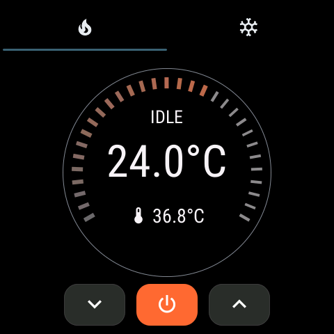

# OpenHASP HVAC Thermostat



OpenHASP 기반 온도조절기 프로젝트입니다. 내장된 SHT20 온습도센서를 사용하여 현재 온도를 측정하고, 냉방/난방 모드를 독립적으로 설정할 수 있습니다. 각 모드별로 설정온도를 UI를 통해 조정할 수 있으며, 모든 데이터는 MQTT를 통해 전송됩니다. 또한 MQTT를 통한 원격 제어도 지원합니다.

## USB to Serial 포트 드라이버 설치 (macOS)

ESP32-S3 장치가 인식되지 않는 경우 CH34x USB to Serial 드라이버를 설치해야 합니다.

### 설치 방법


1. [CH34XSER_MAC_ZIP](http://www.wch.cn/downloads/CH34XSER_MAC_ZIP.html) 에서 드라이버 다운로드
2. ZIP 압축 해제 후 **DMG 파일** 실행 (M1/M2 Mac 권장)
3. "CH34xVCPDriver"를 Applications 폴더로 드래그
4. LaunchPad에서 "CH34xVCPDriver" 앱 실행 후 "Install" 클릭
5. 시스템 설정 → 일반 → 로그인 항목 및 확장 프로그램 → 드라이버 확장 프로그램에서 **CH34xVCPDriver 활성화**
6. 시스템 재부팅

### 설치 확인

장치 연결 후 터미널에서 확인:

```sh
$ ls /dev/tty.*
# tty.wchusbserialXXXXXXX 형태의 장치가 보이면 성공
```

**자세한 설치 가이드**: [WCHSoftGroup/ch34xser_macos](https://github.com/WCHSoftGroup/ch34xser_macos)

## 펌웨어 빌드 준비

[OpenHASP 공식 빌드 가이드](https://www.openhasp.com/0.7.0/firmware/compiling/local/)를 따라 환경을 준비합니다.

### 필요한 도구 설치 확인

다음 도구들이 설치되어 있는지 확인하세요:

- **Python 3**
- **Git**
- **Golang 1.2 이상**
- **PlatformIO extension** (VS Code)

### 코드 통합

이 프로젝트의 코드를 OpenHASP 메인 프로젝트에 복사하여 사용합니다.

## 빌드 및 펌웨어 업로드 (개발자용)

PlatformIO를 사용하여 빌드합니다:

1. **PlatformIO Project Tasks** 패널 열기
2. **`panlee-zw3d95ce01s-tr-4848_16MB`** 환경 선택
3. 빌드 메뉴:
   - **General → Build**: 펌웨어 빌드 (`.pio/build/panlee-zw3d95ce01s-tr-4848_16MB/firmware.bin` 생성)
   - **Platform → Build Filesystem Image**: 파일시스템 빌드 (`data/` → `littlefs.bin` 생성)
   - **General → Upload**: 펌웨어 업로드
   - **General → Monitor**: 시리얼 모니터 실행
   - **General → Upload and Monitor**: 업로드 후 모니터 실행

## 펌웨어 설치 (사용자용)

개발자로부터 다음 두 파일을 받아 설치합니다:

- **firmware.bin**: 메인 펌웨어
- **littlefs.bin**: 파일시스템 (UI 파일 포함)

### 설치 방법

1. 장치를 USB애 연결
2. [웹 플레셔](https://niot-inc.github.io/openhasp-hvac-thermostat/index.html)에 접속

## 장치 설정

### Wi-Fi 및 MQTT 설정

1. **Wi-Fi 설정**: 장치를 네트워크에 연결
2. **MQTT 설정**:
   - **Hostname**: `room1`, `room2` 등 고유한 이름으로 설정 (장치 식별용)
   - **Broker 주소**: MQTT 브로커 IP/도메인
   - **포트**: MQTT 포트 (일반적으로 1883)
   - **사용자명/비밀번호**: MQTT 인증 정보
3. **테마 설정**: **Material Dark**로 설정 (UI가 최적화됨)

### UI 설정

1. 장치 웹 인터페이스의 **파일 에디터**로 이동
2. `pages.jsonl` 파일을 이 프로젝트의 `pages.jsonl` 내용으로 덮어쓰기

## 핵심 기능 및 MQTT 명령어

### 📊 온도 측정 (자동 전송)

내장 SHT20 온습도센서를 통해 **5초마다 자동으로** 온습도 데이터를 MQTT로 전송합니다.

**Topic**: `hasp/<hostname>/state/sensors`

```json
{"temperature":36.7,"humidity":29.9}
```

### 🔄 냉방/난방 제어

UI 터치 또는 MQTT 명령으로 각 모드를 독립적으로 제어할 수 있습니다. **UI 조작 시마다 자동으로 상태가 MQTT로 전송되어 양방향 통신이 가능합니다.**

#### 전원 제어

```bash
# 난방 ON/OFF
mosquitto_pub -t 'hasp/<hostname>/command/custom/heat' -m '{"power":true}'
mosquitto_pub -t 'hasp/<hostname>/command/custom/heat' -m '{"power":false}'

# 냉방 ON/OFF  
mosquitto_pub -t 'hasp/<hostname>/command/custom/cool' -m '{"power":true}'
mosquitto_pub -t 'hasp/<hostname>/command/custom/cool' -m '{"power":false}'
```

#### 목표 온도 설정

```bash
# 난방 목표온도 설정 (15~30도 범위)
mosquitto_pub -t 'hasp/<hostname>/command/custom/heat' -m '{"setpoint": 30}'

# 냉방 목표온도 설정 (15~30도 범위)
mosquitto_pub -t 'hasp/<hostname>/command/custom/cool' -m '{"setpoint": 24}'
```

**참고**: 목표 온도는 **15~30도 범위로 제한**됩니다. 범위를 벗어나는 값은 자동으로 클램프됩니다.

#### 동작 상태 업데이트 (외부 시스템용)

```bash
# 난방 상태 표시 업데이트
mosquitto_pub -t 'hasp/<hostname>/command/custom/heat' -m '{"status":"HEATING"}'
mosquitto_pub -t 'hasp/<hostname>/command/custom/heat' -m '{"status":"IDLE"}'

# 냉방 상태 표시 업데이트
mosquitto_pub -t 'hasp/<hostname>/command/custom/cool' -m '{"status":"COOLING"}'
mosquitto_pub -t 'hasp/<hostname>/command/custom/cool' -m '{"status":"IDLE"}'
```

### 📤 장치 상태 확인

#### 자동 상태 전송 (부팅 시 및 UI 조작 시)

- **부팅 후**: 장치 초기 상태가 자동으로 전송됩니다
- **UI 조작 시**: 터치스크린에서 설정을 변경할 때마다 실시간으로 상태가 전송됩니다

**Topic**: `hasp/<hostname>/state/heat`, `hasp/<hostname>/state/cool`

```json
{"mode":"heat","power":true,"setpoint":24,"current":36.6,"status":"IDLE"}
{"mode":"cool","power":true,"setpoint":24,"current":36.6,"status":"IDLE"}
```

#### 수동 상태 요청

현재 장치 상태를 다시 요청할 수 있습니다:

```bash
# 전체 HVAC 상태 요청
mosquitto_pub -t 'hasp/<hostname>/command/custom/get/hvac' -m ''
```

이 명령을 보내면 장치가 위의 상태 메시지를 다시 전송합니다.

---

**참고**: 더 자세한 설정 및 사용법은 [OpenHASP 공식 문서](https://www.openhasp.com/)를 참조하세요.
